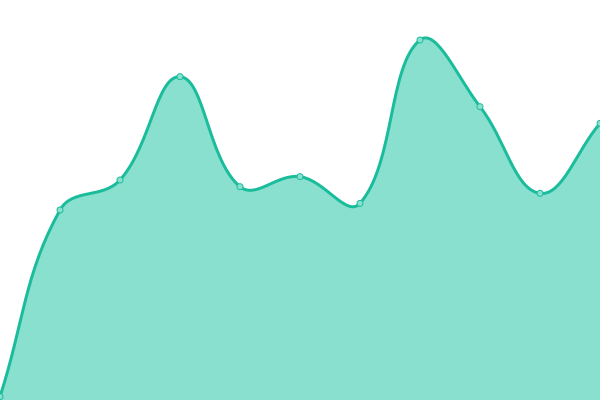
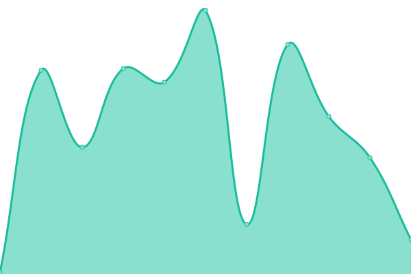

# [📈 Live Status](https://aweiand.github.io/status-ifrs-osorio): <!--live status--> **🟧 Partial outage**

This repository contains the open-source uptime monitor and status page for [Augusto Weiand](http://www.sitches.com.br), powered by [Upptime](https://github.com/upptime/upptime).

With [Upptime](https://upptime.js.org), you can get your own unlimited and free uptime monitor and status page, powered entirely by a GitHub repository. We use [Issues](https://github.com/aweiand/status-ifrs-osorio/issues) as incident reports, [Actions](https://github.com/aweiand/status-ifrs-osorio/actions) as uptime monitors, and [Pages](https://aweiand.github.io/status-ifrs-osorio) for the status page.

<!--start: status pages-->
<!-- This summary is generated by Upptime (https://github.com/upptime/upptime) -->
<!-- Do not edit this manually, your changes will be overwritten -->

| URL                                                     | Status  | History                                                                                                               | Response Time                                                                         | Uptime                                                                                                                                                                                                                                                     |
| ------------------------------------------------------- | ------- | --------------------------------------------------------------------------------------------------------------------- | ------------------------------------------------------------------------------------- | ---------------------------------------------------------------------------------------------------------------------------------------------------------------------------------------------------------------------------------------------------------- |
| [Google](https://www.google.com)                        | 🟥 Down | [google.yml](https://github.com/aweiand/status-ifrs-osorio/commits/master/history/google.yml)                         |  0ms             |                         |
| [Wikipedia](https://en.wikipedia.org)                   | 🟥 Down | [wikipedia.yml](https://github.com/aweiand/status-ifrs-osorio/commits/master/history/wikipedia.yml)                   |  0ms          |                   |
| [Moodle IFRS Osório](https://moodle.osorio.ifrs.edu.br) | 🟥 Down | [moodle-ifrs-osorio.yml](https://github.com/aweiand/status-ifrs-osorio/commits/master/history/moodle-ifrs-osorio.yml) |  0ms |  |
| [Sistrac](https://sistrac.osorio.ifrs.edu.br)           | 🟩 Up   | [sistrac.yml](https://github.com/aweiand/status-ifrs-osorio/commits/master/history/sistrac.yml)                       |  1616ms         |                       |

<!--end: status pages-->

[**Visit our status website →**](https://aweiand.github.io/status-ifrs-osorio)

## 📄 License

- Code: [MIT](./LICENSE) © [Augusto Weiand](http://www.sitches.com.br)
- Data in the `./history` directory: [Open Database License](https://opendatacommons.org/licenses/odbl/1-0/)
